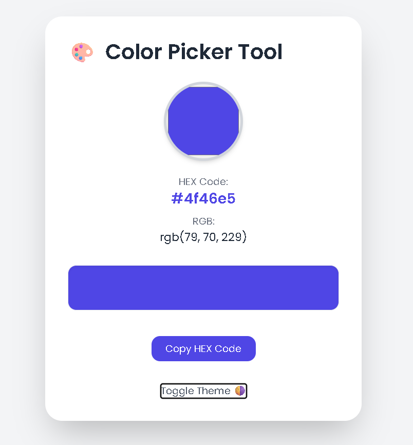
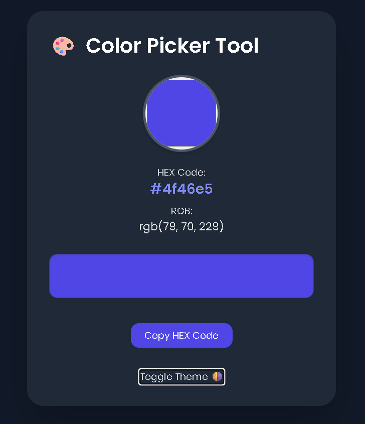

# 🎨 Color Picker App

A sleek, responsive, and fully interactive **Color Picker** web application built using **HTML**, **Tailwind CSS**, and **Vanilla JavaScript**. It supports **dark mode**, shows HEX and RGB values, and allows copying color codes to the clipboard.

---

## 🌟 Features

- 🎨 Pick colors using native color input
- 🌗 Toggle between Light and Dark themes
- 📋 Copy HEX color code to clipboard
- 🧠 Auto conversion to RGB values
- 🖥️ Fully responsive layout (mobile, tablet, desktop)
- 💅 Clean and modern UI using Tailwind CSS

---





---

## 🚀 Getting Started

### Option 1: Run Locally

1. Clone the repository
   ```bash
   git clone https://github.com/your-username/color-picker-app.git
   cd color-picker
